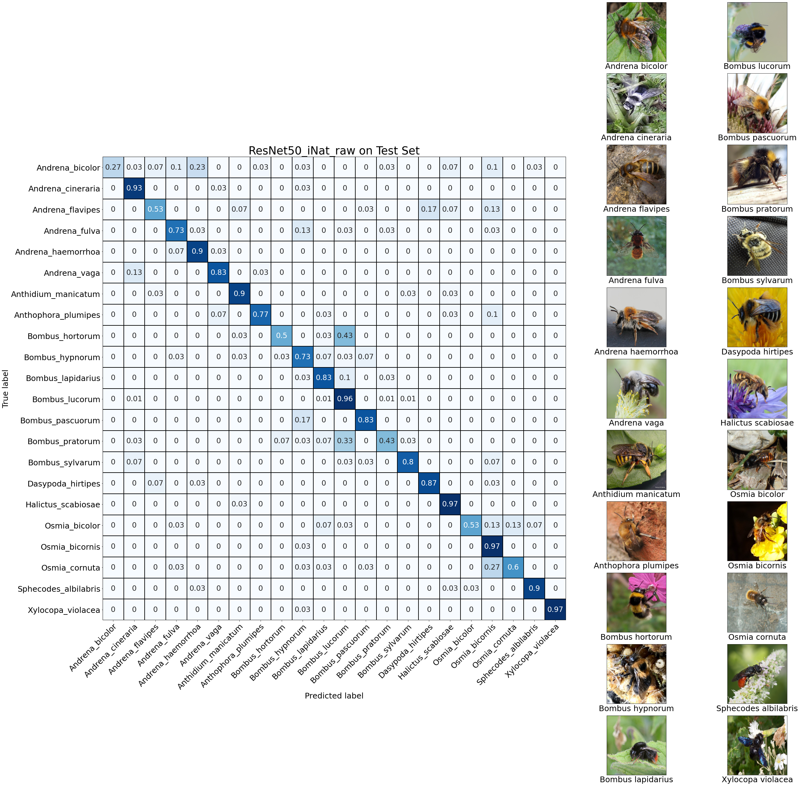
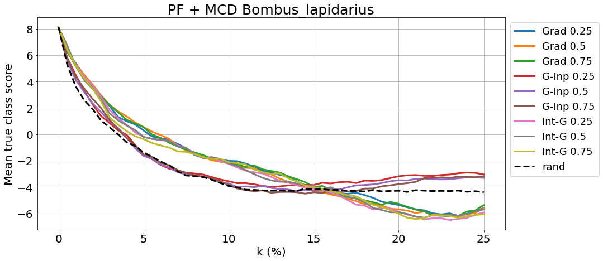

# XAI Experiments on a dataset of wild bees

## Data Acquisition

The script [webscraper_inat.py](scripts/webscraper_inat.py) downloads 
photos of bees from [iNaturalist](https://www.inaturalist.org/observations). 
The user only needs to specify in the *main* section the target folder where 
the photos should be downloaded, a maximum number of photos to search for 
and the corresponding url index of the species. 

For instance, to find the index for the species *Anthidium manicatum*, 
type the species name in the search bar of the *iNaturalist* site and 
copy the number at the end of the url (it should be 62453).

We checked that the wild bee dataset (both mini and full) did not contain 
duplicates from the [iNat Challenge 2021](https://www.kaggle.com/c/inaturalist-2021), 
since we may be interested in utilizing models pretrained on that task. We 
also checked for duplicates within our own datasets and it turned out 
that the scraper did indeed download some images twice (either because 
of the Internet connection going down or because the iNat users themselves 
uploaded the same photo more than once). These duplicates were subsequently 
removed.

## Data Annotation

From the downloaded images a subset of roughly 30 samples per species 
(further also referred to as the *mini dataset*) has 
been selected and further annotated in [Label Studio](https://labelstud.io/). 
The mini dataset eventually contained 726 images for 25 bee species.
More specifically, the insects' main body parts have been segmented through 
brushing (see next section).

## Data Preprocessing

The scripts [create_metafiles_mini.py](scripts/create_metafiles_mini.py) and 
[create_metafiles_all.py](scripts/create_metafiles_all.py) create 
metafiles from the json-files downloaded from Label Studio similar to the 
**CUB200** format. The files created are:

- *classes.txt* (for mini and whole dataset) - each class name is allocated a unique identifier from 1 to 22 or 25. 
The reason why we had a variable number of classes is because of four species that are 
near to impossible to tell apart based solely on image input. These species are 
*Bombus lucorum*, *Bombus cryptarum*, *Bombus terrestris* and *Bombus magnus*. Our tests 
have revealed that, indeed, models also struggle to differentiate these species. 
Consequently, we decided to compress the images from the 4 species under a common label - 
*Bombus lucorum*, which reduced the number of classes down to 22.
- *images.txt* (mini and whole) - each jpg-file is given a unique identifier from 1 to *length_of_dataset*
- *image_class_labels.txt* (mini and whole) - each file ID is mapped to the corresponding class ID
- *parts.txt* (mini) - each relevant body part is given an ID from 1 to 3
- *part_locs.txt* (mini) - each body part from each file is mapped to its `RLE` coordinates; 
each row starts with the file ID followed by the body part ID followed by the list of 
`RLE` coordinates

Additional annotations have also been created in [derive_contours_bboxes.py](scripts/derive_contours_bboxes.py):

- *bounding_boxes.txt* - each file ID is associated with the bounding box coordinates of the whole object
- *part_contours.npy* - contour indexes of the binary masks for every body part. The reason behind it is that 
decoding `RLE` coordinates is relatively time-consuming; therefore, it is preferable to compute the masks only once and store 
them for later training; however, storing large sparse matrices or their positive indexes is not very efficient and since 
Numpy or OpenCV save files in `uint8` at least, the contours of the masks were preferred. At training/inference time, 
the full object masks can easily be retrieved by refilling the contour lines. See an [example](figures/masks_bboxes/Edges_Andrena_fulva_41623103_1.png).
Note that the first entry in the arrays in this file is always a list of `[file_id, part_id]`.

Based on the meta files, [crop_mask_images.py](scripts/create_metafiles_mini.py) derives separate datasets from the original mini set 
by applying different input transformations such as *masking* and *cropping to bounding box*. See [examples](figures/input_transforms).

### Important Note on the `RLE` Format

Beware that the `RLE` format used by Label Studio to store segmentation masks is not 
the same commonly known `RLE` format from the **COCO** dataset. Unlike the **COCO** standard, the `RLE` numbers here are 
not interpreted as pixel counts. Please follow this [issue](https://github.com/heartexlabs/label-studio-converter/issues/95) 
for further details.

### Decoding `RLE` into Segmentation Masks

For translating the `RLE` coordinates into segmentation matrices, the library 
[label-studio-converter](https://github.com/heartexlabs/label-studio-converter) 
was used. Every image is accompanied by three part annotations:

- *Head* - includes the whole head of the insect along with its tentacles
- *Thorax* - middle body together with legs and wings
- *Abdomen* - lower body including needle, if present

The picture below shows the segmentation masks - binary and overlaid - 
in the case of an *Halictus scabiosae*. More examples can be found [here](figures/masks_bboxes). 
The mask of the whole object has been 
computed by means of logical union of the part masks. Note that it sometimes
occured that small pixel patches from within the part segment were not 
brushed over by the annotator. This was corrected through a morphological 
process called *closing*, which is *dilation* followed by *erosion*.

From the object mask, the bounding box can also be easily derived 
(see [annot_computer.py](beexplainable/utils/annot_computers.py)). The 
convention agreed upon here for storing the bounding box coordinates is 
the same as in the [CUB200 dataset](figures/Black_Footed_Albatross_0002_55_bbox.jpg): 
`(x_min, y_min, width, height)`.

## Training and Validation

We have trained a `ResNet50` initialized with a backbone pretrained on the 
[iNat 2021 challenge](https://www.kaggle.com/c/inaturalist-2021) complemented with a linear classifier on the top. 
The *whole* dataset has been used for training and cross validation, while the *mini* dataset 
was kept as test set. Our model's performance compares to similar models trained on other fine-grained tasks - 
[Horn et al.](http://arxiv.org/abs/2103.16483). 

More details regarding the model 
architecture, hypertuning process, as well as training and validation scores can 
be found the cooresponding [notebooks](notebooks) and on our freely online available 
[TensorBoard Experiment](https://tensorboard.dev/experiment/VwaTD5OBSwuxpgK2JH4wCA/#).

## XAI Experiments

For conducting and evaluating the upcoming XAI experiments, the following libraries 
were used: [tf-explain](https://github.com/sicara/tf-explain), [iNNvestigate](https://github.com/albermax/innvestigate) 
and [quantus](https://github.com/understandable-machine-intelligence-lab/Quantus).

### Example of Feature Attribution Maps

### Monte-Carlo Dropout and Pixel Flipping

#### Example of Pixel Flipping w.r.t. 3 Saliency Maps

#### Example of Quantile Maps generated by MC-Dropout

#### Pixel Flipping via MC-Dropout for a whole class in the test set

