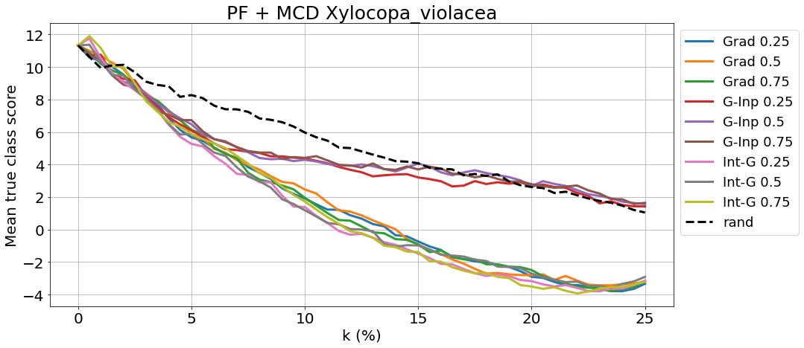
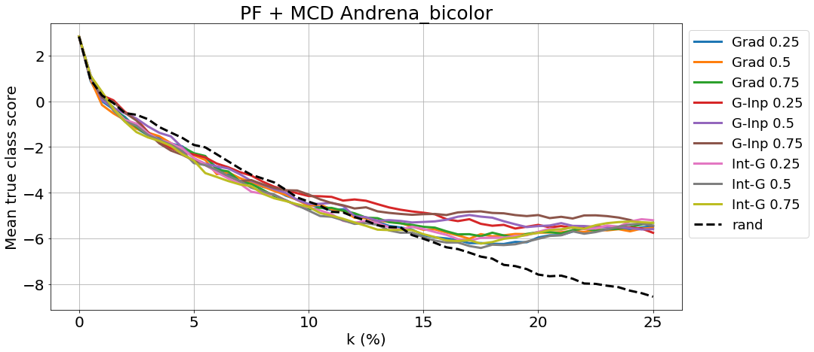

# Towards ML Methods for Biodiversity: A Novel Wild Bee Dataset and Evaluations of XAI Methods for ML-Assisted Rare Species Annotations

## Table of Contents

* [Introduction](#introduction)
* [Data Acquisition](#data-acquisition)
* [Data Annotation](#data-annotation)
* [Data Preprocessing](#data-preprocessing)
* [Training and Validation](#training-and-validation)
* [XAI Experiments](#xai-experiments)

## Introduction
 
A [study](https://journals.plos.org/plosone/article?id=10.1371/journal.pone.0185809) 
published in 2017 revealed a shocking 75% decline in insect biomass in German 
nature protected areas over the past 27 years, mainly because of pesticides, 
intensive farming and climatic changes. But not only the overall number of 
insects has dramatically sunken. The 33,000 different species that used to 
find their habitat in Germany are rapidly vanishing. Multiple organizations 
along with the German Ministry of Environment have joined forces to curb 
the dramatic decrease of insect diversity. Steps have already been taken 
to determine which areas are primarily affected by insect depopulation and 
which species face a high risk of extinction (see 
[Insektensommer](https://www.nabu.de/tiere-und-pflanzen/aktionen-und-projekte/insektensommer/index.html?ref=nav) 
and [DINA](https://www.dina-insektenforschung.de/) - articles in German). 
This is called **insect monitoring** and, given the current availability of 
technology, the goal is to construct automatic systems able to recognize 
insect species without needing to trap and kill any insects. 

Automated insect monitoring requires accurate computer vision (CV) models 
and development of these models, in turn, requires high quality datasets. 
Building such datasets is difficult, as there are few domain experts 
(entomologists) that can annotate images of rare species.

In an ideal human-machine collaborative setting, a Machine Learning (ML) 
algorithm could assist human experts annotating images of rare species 
by automatically annotating some images and referring others to domain 
experts. When working with such complex structures as an insect taxonomic 
tree, model explainability becomes a requirement rather than a nice-to-have 
feature. The entomologists delegated to supervise the monitoring procedure 
need to understand what exactly led their model to the given output.

## Data Acquisition

The script [webscraper_inat.py](scripts/webscraper_inat.py) downloads 
photos of bees from [iNaturalist](https://www.inaturalist.org/observations). 
The user only needs to specify in the *main* section the target folder where 
the photos should be downloaded, a maximum number of photos to search for 
and the corresponding url index of the species. 

For instance, to find the index for the species *Anthidium manicatum*, 
type the species name in the search bar of the *iNaturalist* site and 
copy the number at the end of the url (it should be 62453).

We checked that the wild bee dataset (both mini and full) did not contain 
duplicates from the [iNat Challenge 2021](https://www.kaggle.com/c/inaturalist-2021), 
since we may be interested in utilizing models pretrained on that task. We 
also checked for duplicates within our own datasets and it turned out 
that the scraper did indeed download some images twice (either because 
of the Internet connection going down or because the iNat users themselves 
uploaded the same photo more than once). These duplicates were subsequently 
removed.

## Data Annotation

From the downloaded images a subset of roughly 30 samples per species 
(further also referred to as the *mini dataset*) has 
been selected and further annotated in [Label Studio](https://labelstud.io/). 
The mini dataset eventually contained 726 images for 25 bee species.
More specifically, the insects' main body parts have been segmented through 
brushing, as in the image below:

    

## Data Preprocessing

The scripts [create_metafiles_mini.py](scripts/create_metafiles_mini.py) and 
[create_metafiles_all.py](scripts/create_metafiles_all.py) create 
metafiles from the json-files downloaded from Label Studio similar to the 
**CUB200** format. The files created are:

- *classes.txt* (for mini and whole dataset) - each class name is allocated a unique identifier from 1 to 22 or 25. 
The reason why we had a variable number of classes is because of four species that are 
near to impossible to tell apart based solely on image input. These species are 
*Bombus lucorum*, *Bombus cryptarum*, *Bombus terrestris* and *Bombus magnus*. Our tests 
have revealed that, indeed, models also struggle to differentiate these species. 
Consequently, we decided to compress the images from the 4 species under a common label - 
*Bombus lucorum*, which reduced the number of classes down to 22.
- *images.txt* (mini and whole) - each jpg-file is given a unique identifier from 1 to *length_of_dataset*
- *image_class_labels.txt* (mini and whole) - each file ID is mapped to the corresponding class ID
- *parts.txt* (mini) - each relevant body part is given an ID from 1 to 3
- *part_locs.txt* (mini) - each body part from each file is mapped to its `RLE` coordinates; 
each row starts with the file ID followed by the body part ID followed by the list of 
`RLE` coordinates

Additional annotations have also been created in [derive_contours_bboxes.py](scripts/derive_contours_bboxes.py):

- *bounding_boxes.txt* - each file ID is associated with the bounding box coordinates of the whole object
- *part_contours.npy* - contour indexes of the binary masks for every body part. The reason behind it is that 
decoding `RLE` coordinates is relatively time-consuming; therefore, it is preferable to compute the masks only once and store 
them for later training; however, storing large sparse matrices or their positive indexes is not very efficient and since 
Numpy or OpenCV save files in `uint8` at least, the contours of the masks were preferred. At training/inference time, 
the full object masks can easily be retrieved by refilling the contour lines. See an [example](figures/masks_bboxes/Edges_Andrena_fulva_41623103_1.png).
Note that the first entry in the arrays in this file is always a list of `[file_id, part_id]`.

Based on the meta files, [crop_mask_images.py](scripts/create_metafiles_mini.py) derives separate datasets from the original mini set 
by applying different input transformations such as *masking* and *cropping to bounding box*. See [examples](figures/input_transforms).

### Important Note on the `RLE` Format

Beware that the `RLE` format used by Label Studio to store segmentation masks is not 
the same commonly known `RLE` format from the **COCO** dataset. Unlike the **COCO** standard, the `RLE` numbers here are 
not interpreted as pixel counts. Please follow this [issue](https://github.com/heartexlabs/label-studio-converter/issues/95) 
for further details.

### Decoding `RLE` into Segmentation Masks

For translating the `RLE` coordinates into segmentation matrices, the library 
[label-studio-converter](https://github.com/heartexlabs/label-studio-converter) 
was used. Every image is accompanied by three part annotations:

- *Head* - includes the whole head of the insect along with its tentacles
- *Thorax* - middle body together with legs and wings
- *Abdomen* - lower body including needle, if present

The picture below shows the segmentation masks - binary and overlaid - 
in the case of an *Halictus scabiosae*. More examples can be found [here](figures/masks_bboxes). 
The mask of the whole object has been 
computed by means of logical union of the part masks. Note that it sometimes
occured that small pixel patches from within the part segment were not 
brushed over by the annotator. This was corrected through a morphological 
process called *closing*, which is *dilation* followed by *erosion*.

From the object mask, the bounding box can also be easily derived 
(see [annot_computer.py](beexplainable/utils/annot_computers.py)). The 
convention agreed upon here for storing the bounding box coordinates is 
the same as in the [CUB200 dataset](figures/Black_Footed_Albatross_0002_55_bbox.jpg): 
`(x_min, y_min, width, height)`.

## Training and Validation

We have trained a `ResNet50` initialized with a backbone pretrained on the 
[iNat 2021 challenge](https://www.kaggle.com/c/inaturalist-2021) complemented with a linear classifier on the top. 
The *whole* dataset has been used for training and cross validation, while the *mini* dataset 
was kept as test set. We report **0.78 top-1** and **0.95 top-3 accuracy** on the test set, which is competitive 
with similar state-of-the-art fine-grained models - [Horn et al.](http://arxiv.org/abs/2103.16483). 

More details regarding the model 
architecture, hypertuning process, as well as training and validation scores can 
be found in the cooresponding [notebooks](notebooks), plots for [training curves](figures/training_curves), 
[ROC-AUC curves](figures/roc_auc), [worst predictions](figures/worst_preds) and on our freely online available 
[TensorBoard Experiment](https://tensorboard.dev/experiment/VwaTD5OBSwuxpgK2JH4wCA/#).

## XAI Experiments

### Motivation and Related Work

When working with such complex structures as an insect taxonomic tree, 
model explainability becomes a requirement rather than a nice-to-have feature. 
The entomologists delegated to supervise the monitoring procedure need to 
understand what exactly led their model to the given output. 
Nowadays, there is a wide array of [XAI methods](https://christophm.github.io/interpretable-ml-book/index.html) 
and going into the details of all the possible categorisations would exceed 
the scope of this preliminary work.

The XAI community has been working arduously in the past years to develop 
new XAI methods - [Guidotti et al.](https://arxiv.org/abs/1802.01933) - as well as to formalize the notions of 
*explanation* and *explainability* - [Doshi et al.](https://arxiv.org/abs/1702.08608) 
It has been acknowledged that a key requirement to better these methods 
are quality metrics for XAI, so that model explanations can be evaluated 
and compared to one another - [Adebayo et al. 2018](http://arxiv.org/abs/1810.03292), 
[Adebayop et al. 2020](http://arxiv.org/abs/2011.05429), [Kindermans et al.](http://arxiv.org/abs/1711.00867) 
Next to automated evaluations of XAI methods, researchers also investigated 
XAI methods in human-in-the-loop settings - [Hase and Bansal](https://arxiv.org/abs/2005.01831), but it remains unclear 
to what extent these two types of evaluations are related - [Bießmann and Refiano](http://arxiv.org/abs/2107.02033), 
[Borowski et al](https://arxiv.org/abs/2010.12606).

For conducting and evaluating the upcoming XAI experiments, the following libraries 
were used: [tf-explain](https://github.com/sicara/tf-explain), [iNNvestigate](https://github.com/albermax/innvestigate) 
(for computing the explanations) and [quantus](https://github.com/understandable-machine-intelligence-lab/Quantus) 
(for evaluating them). In the initial stages of our research, we decided to focus our 
attention on **post hoc feature attribution based methods**, also known as **saliency maps** 
(see example below).

The maps are normalized from 0 (blue) to 1 (red).

### Evaluation

The authors of *quantus* define a simple set of 'desiderata', that is, 
properties that good XAI methods are expected to have: *faithfulness*, 
*localisation*, *robustness*, *complexity*, *randomisation* and *axiomatic properties*. 
For our work, we decided to first investigate the first two and provide initial 
results. 

#### Localisation via Segmentation Masks

We have used the segmentation masks drawn manually as the ground 
truth for our model's explanations, measuring to what extent 
the 'hot pixels' fall into our masks. The results are shown 
in the table below. We note that the model achieves higher 
scores on metrics such as Pointing Game and AUC, that evaluate 
localisation on a coarse level. On the other hand, the model 
performs rather poorly on the other 'finer-grained' metrics, 
which compute a more in-depth assessment of how well the 
salient regions overlap with the segmentation masks.

Metric | Gradient   | Grad. * Input | Int. Grad. | 
-------- |------------|---------------|------------|
Pointing Game | **0.9463** | 0.9421           | 0.9298     |
Attribution Localisation | 0.2984        | 0.2551           | **0.3168** | 
Top K Intersection | 0.3320        | 0.2807           | **0.3547** | 
Relevance Rank Accuracy | 0.3047        | 0.2587           | **0.3231** | 
AUC | 0.7157        | 0.6671           | **0.7297** | 

#### Faithfulness via Monte-Carlo Dropout and Pixel Flipping

Inspired by [Bykov et al.](http://arxiv.org/abs/2006.09000), we evaluated 
the faithfulness of the explanations via *Pixel Flipping (PF)* in 
conjunction with the model's prediction uncertainty via *Monte-Carlo Dropout(MCD)*. 
By activating the Dropout layer during inference, the network predicts 
class probability distributions instead of pointwise estimations. For 
instance, in the figure below, the breadth of the histogram is indicative 
of the model's predictive uncertainty.

    

#### Example of Pixel Flipping w.r.t. 3 Saliency Maps

Pixel FLipping presumes replacing certain pixels in the input and 
re-evaluating the model's prediction. In the two examples below, 
we see an example of flipping pixels in a sample image randomly and 
according to highlighted pixels in saliency maps. The replacement pixels 
are generated randomly from a normal distribution computed over all the 
images of the test set.

    

#### Example of Quantile Maps generated by MC-Dropout

For every new (Monte-Carlo) prediction, a new saliency maps is 
constructed by each of the three methods. The pixels that are 
marked as relevant throughout all the saliency quantiles are 
supposed to represent stable relevant features.

#### Pixel Flipping via MC-Dropout for a whole class in the test set

The quantile maps from the figure above serve here as markers of 
relevant features in the image. By iteratively masking these relevant 
pixels, we can judge how important they truly are for identifying 
the correct class. The greater their relevance, the steeper the 
decrease in the prediction scores. We would expect good XAI methods 
to exhibit a rapid and steep decrease in the accuracy curves, as 
more and more 'relevant' pixels are flipped; moreover, the 
saliency flipping curves would be expected to fall below the 
random flipping curve already in the early flipping iterations 
(like in the plot for *Xylocopa violacea*). Nonetheless, most of 
our plots were rather similar to *Andrena bicolor*, where saliency 
flipping does not appear to be more efficient than random 
flipping. On the contrary, sometimes it was visibly less efficient.

## Conclusion

Our results suggest that evaluation of XAI methods remains 
challenging in niche domains such as rare species classification. 
The heterogeneity of quality metrics across different XAI methods 
indicates that choosing the best XAI method for improving 
annotation experiences for human experts might require further 
evaluations with human-in-the-loop experiments. We hope that the 
model, the dataset and the evaluations provided in this work will 
help researchers to develop models, XAI methods and ML-assisted 
annotation tools to support entomologists and ultimately improve 
our understanding of biodiversity.